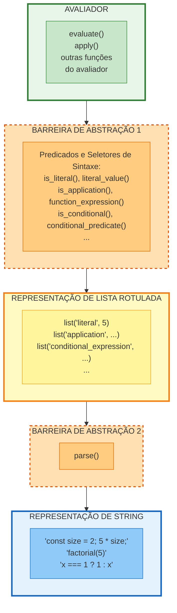

import HelpFooter from '@site/src/components/HelpFooter';

# 4.1.2 Representando Componentes

Os programadores escrevem programas como texto, ou seja, sequências de caracteres, inseridas em um ambiente de programação ou um editor de texto. Para executar nosso avaliador, precisamos começar com uma representação desse texto do programa como um valor JavaScript. Na seção 1.1.4 introduzimos strings para representar texto. Gostaríamos de avaliar programas como `"const size = 2; 5 * size;"` da seção 1.1.2. Infelizmente, esse texto do programa não fornece estrutura suficiente para o avaliador. Neste exemplo, as partes do programa `"size = 2"` e `"5 * size"` parecem semelhantes, mas carregam significados muito diferentes. Funções de sintaxe abstrata como `declaration_value_expression` seriam difíceis e propensas a erros para implementar examinando o texto do programa. Nesta seção, portanto, introduzimos uma função `parse` que traduz o texto do programa para uma *representação de lista rotulada*, reminiscente dos dados rotulados da seção 2.4.2.

Por exemplo, a aplicação de `parse` à string do programa acima produz uma estrutura de dados que reflete a estrutura do programa: uma sequência consistindo de uma declaração de constante associando o nome `size` com o valor 2 e uma multiplicação.

```javascript
parse("const size = 2; 5 * size;");
```

```
list("sequence",
     list(list("constant_declaration",
               list("name", "size"), list("literal", 2)),
          list("binary_operator_combination", "*",
               list("literal", 5), list("name", "size"))))
```

As funções de sintaxe usadas pelo avaliador acessam a representação de lista rotulada produzida por `parse`.

O avaliador lembra o programa de diferenciação simbólica discutido na seção 2.3.2. Ambos os programas operam em dados simbólicos. Em ambos os programas, o resultado de operar em um objeto é determinado operando recursivamente nas partes do objeto e combinando os resultados de uma maneira que depende do tipo do objeto. Em ambos os programas usamos abstração de dados para desacoplar as regras gerais de operação dos detalhes de como os objetos são representados. No programa de diferenciação isso significava que a mesma função de diferenciação poderia lidar com expressões algébricas na forma prefixada, na forma infixada ou em alguma outra forma. Para o avaliador, isso significa que a sintaxe da linguagem sendo avaliada é determinada exclusivamente por `parse` e as funções que classificam e extraem partes das listas rotuladas produzidas por `parse`.



**Figura:** Abstração de sintaxe no avaliador. A barreira de abstração 1 (predicados e seletores) separa o avaliador da representação de lista rotulada. A barreira de abstração 2 (`parse`) separa a representação de lista da representação de string.

A figura acima representa a barreira de abstração formada pelos predicados e seletores de sintaxe, que interfaceiam o avaliador à representação de lista rotulada de programas, que por sua vez é separada da representação de string por `parse`. Abaixo descrevemos o parsing de componentes do programa e listamos os predicados e seletores de sintaxe correspondentes, bem como construtores se forem necessários.

## Expressão Literal

Expressões literais são analisadas em listas rotuladas com a tag `"literal"` e o valor real.

```
⟪ literal-expression ⟫ = list("literal", value)
```

onde *value* é o valor JavaScript representado pela string *literal-expression*. Aqui ⟪ *literal-expression* ⟫ denota o resultado do parsing da string *literal-expression*.

```javascript
parse("1;");
```

```
list("literal", 1)
```

```javascript
parse("'hello world';");
```

```
list("literal", "hello world")
```

```javascript
parse("null;");
```

```
list("literal", null)
```

O predicado de sintaxe para expressões literais é `is_literal`.

```javascript
function is_literal(component) {
    return is_tagged_list(component, "literal");
}
```

É definido em termos da função `is_tagged_list`, que identifica listas que começam com uma string designada:

```javascript
function is_tagged_list(component, the_tag) {
    return is_pair(component) && head(component) === the_tag;
}
```

O segundo elemento da lista que resulta do parsing de uma expressão literal é seu valor JavaScript real. O seletor para recuperar o valor é `literal_value`.

```javascript
function literal_value(component) {
    return head(tail(component));
}
```

No restante desta seção, apenas listamos os predicados e seletores de sintaxe, e omitimos suas declarações se eles apenas acessam os elementos óbvios da lista.

Fornecemos um construtor para literais, que será útil:

```javascript
function make_literal(value) {
    return list("literal", value);
}
```

## Nomes

A representação de lista rotulada para nomes inclui a tag `"name"` como primeiro elemento e a string representando o nome como segundo elemento.

```
⟪ name ⟫ = list("name", symbol)
```

onde *symbol* é uma string que contém os caracteres que compõem o *name* como escrito no programa. O predicado de sintaxe para nomes é `is_name`.

```javascript
function is_name(component) {
    return is_tagged_list(component, "name");
}
```

O símbolo é acessado usando o seletor `symbol_of_name`.

```javascript
function symbol_of_name(component) {
    return head(tail(component));
}
```

Fornecemos um construtor para nomes, a ser usado por `operator_combination_to_application`:

```javascript
function make_name(symbol) {
    return list("name", symbol);
}
```

## Declarações de Expressão

Não precisamos distinguir entre expressões e declarações de expressão. Consequentemente, `parse` pode ignorar a diferença entre os dois tipos de componentes:

```
⟪ expression; ⟫ = ⟪ expression ⟫
```

## Aplicações de Função

Aplicações de função são analisadas da seguinte forma:

```
⟪ fun-expr(arg-expr₁, …, arg-exprₙ) ⟫ =
    list("application",
         ⟪ fun-expr ⟫,
         list(⟪ arg-expr₁ ⟫, …, ⟪ arg-exprₙ ⟫))
```

Declaramos `is_application` como o predicado de sintaxe e `function_expression` e `arg_expressions` como os seletores.

```javascript
function is_application(component) {
   return is_tagged_list(component, "application");
}
function function_expression(component) {
   return head(tail(component));
}
function arg_expressions(component) {
   return head(tail(tail(component)));
}
```

Adicionamos um construtor para aplicações de função, a ser usado por `operator_combination_to_application`:

```javascript
function make_application(function_expression, argument_expressions) {
    return list("application",
                function_expression, argument_expressions);
}
```

## Condicionais

Expressões condicionais são analisadas da seguinte forma:

```
⟪ predicate ? consequent-expression : alternative-expression ⟫ =
    list("conditional_expression",
         ⟪ predicate ⟫,
         ⟪ consequent-expression ⟫,
         ⟪ alternative-expression ⟫)
```

Similarmente, declarações condicionais são analisadas da seguinte forma:

```
⟪ if (predicate) consequent-block else alternative-block ⟫ =
    list("conditional_statement",
         ⟪ predicate ⟫,
         ⟪ consequent-block ⟫,
         ⟪ alternative-block ⟫)
```

O predicado de sintaxe `is_conditional` retorna verdadeiro para ambos os tipos de condicionais, e os seletores `conditional_predicate`, `conditional_consequent` e `conditional_alternative` podem ser aplicados a ambos os tipos.

```javascript
function is_conditional(component) {
    return is_tagged_list(component, "conditional_expression") ||
           is_tagged_list(component, "conditional_statement");
}
function conditional_predicate(component) {
   return list_ref(component, 1);
}
function conditional_consequent(component) {
   return list_ref(component, 2);
}
function conditional_alternative(component) {
   return list_ref(component, 3);
}
```

## Expressões Lambda

Uma expressão lambda cujo corpo é uma expressão é analisada como se o corpo consistisse de um bloco contendo uma única declaração de retorno cuja expressão de retorno é o corpo da expressão lambda.

```
⟪ (name₁, …, nameₙ) => expression ⟫ =
    ⟪ (name₁, …, nameₙ) => { return expression; } ⟫
```

Uma expressão lambda cujo corpo é um bloco é analisada da seguinte forma:

```
⟪ (name₁, …, nameₙ) => block ⟫ =
    list("lambda_expression",
         list(⟪ name₁ ⟫, …, ⟪ nameₙ ⟫),
         ⟪ block ⟫)
```

O predicado de sintaxe é `is_lambda_expression` e o seletor para o corpo da expressão lambda é `lambda_body`. O seletor para os parâmetros, chamado `lambda_parameter_symbols`, adicionalmente extrai os símbolos dos nomes.

```javascript
function lambda_parameter_symbols(component) {
    return map(symbol_of_name, head(tail(component)));
}
```

## Sequências

Uma sequência é um componente composto consistindo de zero ou mais componentes a serem avaliados em ordem. Uma sequência aparece como o corpo de um bloco ou como o corpo de uma expressão lambda (que na verdade sempre é um bloco). A função `parse` representa sequências como listas rotuladas.

```
⟪ component₁ ... componentₙ ⟫ = list(⟪ component₁ ⟫, ..., ⟪ componentₙ ⟫)
```

Para sequências, fornecemos um construtor `make_sequence` (usado pela função `cond_to_if` do exercício 4.5), um predicado `is_sequence`, e seletores `sequence_statements`, `is_empty_sequence`, `first_statement`, e `rest_statements`.

```javascript
function make_sequence(stmts) {
   return list("sequence", stmts);
}
function is_sequence(stmt) {
   return is_tagged_list(stmt, "sequence");
}
function sequence_statements(stmt) {
   return head(tail(stmt));
}
function is_empty_sequence(stmts) {
   return is_null(stmts);
}
function is_last_statement(stmts) {
   return is_null(tail(stmts));
}
function first_statement(stmts) {
   return head(stmts);
}
function rest_statements(stmts) {
   return tail(stmts);
}
```

## Blocos e Declarações de Retorno

Blocos são analisados em listas rotuladas, começando com a string `"block"`. O corpo de um bloco é uma sequência de declarações.

```
⟪ { component₁ ... componentₙ } ⟫ = list("block", ⟪ component₁ ... componentₙ ⟫)
```

A avaliação de um bloco resulta na avaliação do corpo do bloco em um ambiente que estende o ambiente atual com um novo frame. Os nomes declarados no corpo devem ser adicionados ao novo frame antes que o corpo seja avaliado, como indicado no final da seção 4.1.1.

Fornecemos um construtor para blocos, um predicado `is_block`, e um seletor `block_body` que recupera o corpo do bloco:

```javascript
function make_block(stmt) {
   return list("block", stmt);
}
function is_block(component) {
    return is_tagged_list(component, "block");
}
function block_body(component) {
    return head(tail(component));
}
```

Declarações de retorno vêm em duas formas.

```
⟪ return expression; ⟫ = list("return_statement", ⟪ expression ⟫)

⟪ return; ⟫ = list("return_statement", list("literal", undefined))
```

Fornecemos um predicado e um seletor para declarações de retorno. Usamos também o construtor `make_return_statement` na próxima subseção.

```javascript
function is_return_statement(component) {
   return is_tagged_list(component, "return_statement");
}
function return_expression(component) {
   return head(tail(component));
}
function make_return_statement(return_expression) {
   return list("return_statement", return_expression);
}
```

## Atribuições

Atribuições têm a forma:

```
⟪ name = expression; ⟫ = list("assignment", ⟪ name ⟫, ⟪ expression ⟫)
```

Fornecemos um predicado de sintaxe e dois seletores:

```javascript
function is_assignment(component) {
   return is_tagged_list(component, "assignment");
}
function assignment_symbol(component) {
   return symbol_of_name(head(tail(component)));
}
function assignment_value_expression(component) {
   return head(tail(tail(component)));
}
```

## Declarações

Declarações de constante, variável e função são analisadas em listas rotuladas:

```
⟪ const name = expression; ⟫ =
    list("constant_declaration", ⟪ name ⟫, ⟪ expression ⟫)

⟪ let name = expression; ⟫ =
    list("variable_declaration", ⟪ name ⟫, ⟪ expression ⟫)

⟪ function name(name₁, ..., nameₙ) block ⟫ =
    list("function_declaration", ⟪ name ⟫,
         list(⟪ name₁ ⟫, ..., ⟪ nameₙ ⟫), ⟪ block ⟫)
```

Nosso avaliador transforma declarações de função em declarações de constante de expressões lambda antes de avaliá-las:

```
⟪ function name(name₁, ..., nameₙ) block ⟫
⇒ ⟪ const name = (name₁, ..., nameₙ) => block; ⟫
```

A transformação é realizada pela função `function_decl_to_constant_decl`, que usa o construtor `make_constant_declaration`.

```javascript
function function_decl_to_constant_decl(component) {
    return make_constant_declaration(
               function_declaration_name(component),
               make_lambda_expression(
                   function_declaration_parameters(component),
                   function_declaration_body(component)));
}
function make_constant_declaration(name, value_expression) {
    return list("constant_declaration", name, value_expression);
}
function make_lambda_expression(parameters, body) {
    return list("lambda_expression", parameters, body);
}
```

Fornecemos predicados de sintaxe e seletores para as três formas de declarações. Observe que `is_declaration` retorna verdadeiro para todos os três tipos de declarações.

```javascript
function is_declaration(component) {
    return is_tagged_list(component, "constant_declaration") ||
           is_tagged_list(component, "variable_declaration") ||
           is_tagged_list(component, "function_declaration");
}
function is_constant_declaration(component) {
   return is_tagged_list(component, "constant_declaration");
}
function is_variable_declaration(component) {
   return is_tagged_list(component, "variable_declaration");
}
function is_function_declaration(component) {
   return is_tagged_list(component, "function_declaration");
}
function declaration_symbol(component) {
   return symbol_of_name(head(tail(component)));
}
function declaration_value_expression(component) {
   return head(tail(tail(component)));
}
function function_declaration_name(component) {
   return list_ref(component, 1);
}
function function_declaration_parameters(component) {
   return list_ref(component, 2);
}
function function_declaration_body(component) {
   return list_ref(component, 3);
}
```

## Combinações de Operadores

Nosso avaliador reduz combinações de operadores—aplicações de operadores como `+` e `*` e operadores lógicos como `&&`, `||` e `!`—a aplicações de função antes de avaliá-las. Por exemplo, a combinação

```javascript
3 + 4 * 5;
```

é transformada em uma aplicação antes da avaliação:

```javascript
(3) + ((4) * (5));
```

onde `+` e `*` são nomes. Expressões condicionais `c ? x : y` são combinações de operadores com o operador `?:`, que é tratado de forma especial e não transformado dessa maneira.

Expressões de operadores unários são parseadas da seguinte forma:

```
⟪ unary-operator expression ⟫ =
    list("unary_operator_combination",
         unary-operator-symbol, ⟪ expression ⟫)
```

onde *unary-operator-symbol* é a string que consiste nos caracteres que constituem o operador unário.

Expressões de operadores binários são parseadas da seguinte forma:

```
⟪ expression₁ binary-operator expression₂ ⟫ =
    list("binary_operator_combination",
         binary-operator-symbol, ⟪ expression₁ ⟫, ⟪ expression₂ ⟫)
```

onde *binary-operator-symbol* é a string que consiste nos caracteres que constituem o operador binário.

A função `operator_combination_to_application` transforma combinações de operadores em aplicações de função. Ela considera operadores unários e binários separadamente e usa as funções auxiliares `make_application` e `make_name` das subseções anteriores.

```javascript
function operator_combination_to_application(component) {
    const operator = operator_symbol(component);
    return is_unary_operator_combination(component)
           ? make_application(make_name(operator),
                 list(first_operand(component)))
           : make_application(make_name(operator),
                 list(first_operand(component),
                      second_operand(component)));
}
```

Para dar suporte a `operator_combination_to_application`, precisamos de um predicado e seletores para combinações de operadores:

```javascript
function is_operator_combination(component) {
    return is_unary_operator_combination(component) ||
           is_binary_operator_combination(component);
}
function is_unary_operator_combination(component) {
    return is_tagged_list(component,
                          "unary_operator_combination");
}
function is_binary_operator_combination(component) {
    return is_tagged_list(component,
                          "binary_operator_combination");
}
function operator_symbol(component) {
    return list_ref(component, 1);
}
function first_operand(component) {
    return list_ref(component, 2);
}
function second_operand(component) {
    return list_ref(component, 3);
}
```

## Componentes Derivados

Alguns
forms sintáticas
em nossa linguagem podem ser definidos em termos de forms relacionados, mas mais primitivos. Por exemplo, podemos expressar `if`-`else` como uma forma sintática especial sem definir uma nova forma de avaliação. Simplesmente transformamos declarações condicionais em expressões condicionais e blocos apropriados, e transformamos expressões condicionais sem `else` de modo que avaliem para `undefined` quando o predicado for falso. Aqui está a regra de transformação para transformar declarações condicionais em expressões condicionais:

```
⟪ if (predicate) consequent else alternative ⟫
⇒ ⟪ predicate ? consequent : alternative ⟫
```

Aqui está a implementação da transformação:

```javascript
function conditional_statement_to_expression(component) {
    return make_conditional_expression(
               conditional_predicate(component),
               conditional_consequent(component),
               conditional_alternative(component));
}
function make_conditional_expression(predicate,
                                      consequent,
                                      alternative) {
    return list("conditional_expression",
                predicate, consequent, alternative);
}
```

A segunda regra de transformação traduz as expressões condicionais sem alternativa adicionando `undefined` como alternativa:

```
⟪ predicate ? consequent ⟫
⇒ ⟪ predicate ? consequent : undefined ⟫
```

Aqui está a implementação da transformação:

```javascript
function conditional_expression_to_expression(component) {
    return make_conditional_expression(
               conditional_predicate(component),
               conditional_consequent(component),
               make_literal(undefined));
}
```

Forms sintáticas que podem ser implementados como transformações sintáticas são chamados de *componentes derivados*. Traduzir uma declaração `switch` (exercício 4.7) em expressões condicionais aninhadas é um exemplo de componente derivado.

## Exercício 4.4

Observe que não podemos dizer se o avaliador metacircular avalia operandos da esquerda para a direita ou da direita para a esquerda. Sua ordem de avaliação é herdada do JavaScript subjacente: Se os argumentos para `pair` em `list_of_values` são avaliados da esquerda para a direita, então `list_of_values` avaliará operandos da esquerda para a direita; e se os argumentos para `pair` são avaliados da direita para a esquerda, então `list_of_values` avaliará operandos da direita para a esquerda.

Escreva uma versão de `list_of_values` que avalia operandos da esquerda para a direita independentemente da ordem de avaliação no JavaScript subjacente. Também escreva uma versão de `list_of_values` que avalia operandos da direita para a esquerda.

## Exercício 4.5

A avaliação de combinações de operadores funciona transformando-as em aplicações de função e depois avaliando-as. Fornecemos essa abordagem para tornar nosso avaliador menos dependente de características específicas do JavaScript. Se quiséssemos estender nosso avaliador metacircular para usar recursos especiais do JavaScript, poderíamos modificar a avaliação de combinações de operadores da seguinte forma:

```javascript
is_operator_combination(component)
? apply(evaluate(operator_symbol(component), env),
        list_of_values(operands(component), env))
```

Infelizmente, esse esquema funcionaria apenas se nossas funções primitivas (veja a seção 4.1.4) incluíssem as funções correspondentes aos operadores do JavaScript. Para não depender disso, usamos a transformação sintática `operator_combination_to_application` para reduzir combinações de operadores a aplicações de função.

Explique, usando exemplos, o que poderia dar errado se não usássemos essa transformação. Dica: Qual é a diferença fundamental entre

```javascript
const result = (10 > 9) && (9 >= 9);
```

e

```javascript
const result = and(10 > 9, 9 >= 9);
```

se `and` for uma função?

## Exercício 4.6

JavaScript inclui os forms sintáticos especiais `&&` e `||`, definidos em termos de avaliação condicional como segue:

- A combinação `&&` retorna o valor de seu segundo operando se seu primeiro operando avaliar para verdadeiro, e o valor do primeiro operando caso contrário.
- A combinação `||` retorna o valor de seu segundo operando se seu primeiro operando avaliar para falso, e o valor do primeiro operando caso contrário.

Implemente `&&` e `||` como novos tipos de componentes, transformando-os em expressões condicionais apropriadas. Alternativamente, mostre como implementar `&&` e `||` como funções derivadas.

## Exercício 4.7

JavaScript possui declarações switch. Considere a seguinte declaração `switch`:

```javascript
switch (x) {
    case 1:
        f();
        break;
    case 2:
    case 3:
        g();
        break;
    default:
        h();
}
```

Se `x` avaliar para 1, então `f()` é avaliado e a declaração switch termina. Se `x` avaliar para 2 ou 3, então `g()` é avaliado e a declaração switch termina. Caso contrário, `h()` é avaliado e a declaração switch termina.

Implemente declarações switch para o avaliador traduzindo-as em componentes apropriados usando a função `switch_to_cond`.

## Exercício 4.8

Implemente loops `while` para o avaliador tratando-os como componentes derivados que são traduzidos em aplicações de funções. Especificamente, traduza a declaração

```javascript
while (predicate) body
```

em uma aplicação de uma função apropriada definida usando uma declaração de função com um nome não convencional (para evitar conflitos com nomes de usuário). Sua tradução deve suportar duas facilidades adicionais:

1. Implemente uma declaração `break;` que imediatamente termina o loop no qual é avaliado.
2. Implemente uma declaração `continue;` que termina apenas a iteração do loop na qual é avaliado, e continua avaliando o predicado do loop while.

## Exercício 4.9

O resultado de avaliar o corpo de uma função é determinado por suas declarações de retorno. Seguindo a nota de rodapé sobre declarações não-value-producing e a avaliação de declarações na seção 4.1.1, este exercício aborda a questão do que deve ser o resultado de avaliar um programa JavaScript que consiste em uma sequência de declarações (declarações, blocos, declarações de expressão e declarações condicionais) *fora de* qualquer corpo de função.

Para tal programa, JavaScript distingue estaticamente entre declarações *value-producing* e declarações *non-value-producing*. (Aqui "estaticamente" significa que podemos fazer a distinção *inspecionando* o programa ao invés de executá-lo.) Todas as declarações são non-value-producing, e todas as declarações de expressão e declarações condicionais são value-producing. O valor de uma declaração de expressão é o valor da expressão. O valor de uma declaração condicional é o valor do ramo que é executado, ou o valor `undefined` se esse ramo não for value-producing. Um bloco é value-producing se seu corpo (sequência de declarações) for value-producing, e então seu valor é o valor de seu corpo. Uma sequência é value-producing se qualquer uma de suas declarações componentes for value-producing, e então seu valor é o valor de sua *última* declaração componente value-producing. Finalmente, se o programa inteiro não for value-producing, seu valor é o valor `undefined`.

1. De acordo com esta especificação, quais são os valores dos seguintes quatro programas?

```javascript
1; 2; 3;

1; { if (true) {} else { 2; } }

1; const x = 2;

1; { let x = 2; { x = x + 3; } }
```

2. Modifique o avaliador para aderir a esta especificação.

<HelpFooter />
